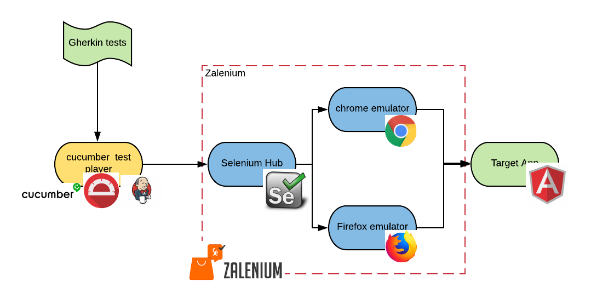

# A Sample OpenShift Pipeline for running integration tests

This example demonstrates how to implement a full end-to-end Jenkins Pipeline for a Java application in OpenShift Container Platform.
On top of the features showed in the [basic spring boot example](https://github.com/redhat-cop/container-pipelines/tree/master/basic-spring-boot), this example shows
* how to run integration tests written using the cucumber/protractor/selenium/zalenium stack
* tests can in throry be run on any combination of browser and os, that can be containerized. In practice here we show chrome and firefox 
* how to collect the test result and show the report in the jenkins pipeline result.

## Architecture

The test archietcture is shown in the followinf image



the main components are:
* [gherkin](https://docs.cucumber.io/gherkin/) tests, tests expressed in english natural languafe to enable [BDD](https://en.wikipedia.org/wiki/Behavior-driven_development)
* [cucumber](https://cucumber.io/) as the interepreter of gherkin
* [protractor](https://www.protractortest.org/#/) as the framework to run the tests (as this is an angularjs application)
* a custom jenkins slave able to run the protractor tests
* [zalenium](https://opensource.zalando.com/zalenium/) to dynamically create [selenium grid](https://www.seleniumhq.org/docs/07_selenium_grid.jsp) clusters of variable size based on demand in kubernetes
* selenium hub, the brain of the selenium cluster
* selenium nodes with chrome and firefox
* the target application

The following breaks down the architecture of the pipeline deployed, as well as walks through the manual deployment steps

## Deployment tl;dr
```
oc process -f applier/projects/projects.yml | oc apply -f -
oc process openshift//jenkins-ephemeral | oc apply -f- -n todomvc-build
oc env dc/jenkins JENKINS_JAVA_OVERRIDES=-Dhudson.model.DirectoryBrowserSupport.CSP='' INSTALL_PLUGINS=ansicolor:0.5.2 -n todomvc-build
oc new-build --strategy docker --name jenkins-slave-nodejs8 --context-dir cucumber-selenium-grid/nodejs-slave https://github.com/raffaelespazzoli/container-pipelines#selenium -n todomvc-build 
oc process -f applier/templates/deployment.yml --param-file=applier/params/deployment-dev | oc apply -f-
oc process -f applier/templates/deployment.yml --param-file=applier/params/deployment-stage | oc apply -f-
oc process -f applier/templates/deployment.yml --param-file=applier/params/deployment-prod | oc apply -f-
oc adm policy add-scc-to-user anyuid -z zalenium -n todomvc-stage
oc process -f applier/templates/selenium-grid.yaml NAMESPACE=todomvc-stage | oc apply -f -
oc process -f applier/templates/build.yml --param-file applier/params/build-dev | oc apply -f-
```
to clean up
```
oc delete project todomvc-build todomvc-dev todomvc-prod todomvc-stage
```

## Automated Quickstart

This quickstart can be deployed quickly using Ansible. Here are the steps.

1. Clone [this repo](https://github.com/redhat-cop/container-pipelines) and the [openshift-applier](https://github.com/redhat-cop/openshift-applier) repo.
2. Log into an OpenShift cluster, then run the following command.
```
$ oc login
$ ansible-playbook -i ./applier/inventory/ /path/to/openshift-applier/playbooks/openshift-cluster-seed.yml
```

At this point you should have 4 projects deployed (`basic-spring-boot-build`, `basic-spring-boot-dev`, `basic-spring-boot-stage`, and `basic-spring-boot-prod`).

## Project Structure

### OpenShift Templates

The components of this pipeline are divided into two templates.

The first template, `applier/templates/build.yml` is what we are calling the "Build" template. It contains:

* A `jenkinsPipelineStrategy` BuildConfig
* An `s2i` BuildConfig
* An ImageStream for the s2i build config to push to

The build template contains a default source code repo for a java application compatible with this pipelines architecture (https://github.com/redhat-cop/spring-rest).

The second template, `applier/templates/deployment.yml` is the "Deploy" template. It contains:

* A tomcat8 DeploymentConfig
* A Service definition
* A Route

The idea behind the split between the templates is that I can deploy the build template only once (to my dev project) and that the pipeline will promote my image through all of the various stages of my application's lifecycle. The deployment template gets deployed once to each of the stages of the application lifecycle (once per OpenShift project).

There is also an additional template that sets up the zalenium infrastructure in `applier/templates/selenium-grid.yaml`

### Pipeline Script

This project includes a sample `Jenkinsfile` pipeline script that could be included with a Java project in order to implement a basic CI/CD pipeline for that project, under the following assumptions:

* The project is built with Maven
* The OpenShift projects that represent the Application's lifecycle stages are of the naming format: `<app-name>-dev`, `<app-name>-stage`, `<app-name>-prod`.


## Bill of Materials

* One or Two OpenShift Container Platform Clusters
  * OpenShift 3.5+ is required
* Access to GitHub
* dynamic provisioning able to provsion RWO and RWM types of volumes.
* ability to make calls from the `dev` project to the `stage` project

## Manual Deployment Instructions

### 1. Create Lifecycle Stages

For the purposes of this demo, we are going to create three stages for our application to be promoted through.

- `todomvc-build`
- `todomvc-dev`
- `todomvc-stage`
- `todomvc-prod`

In the spirit of _Infrastructure as Code_ we have a YAML file that defines the `ProjectRequests` for us. This is as an alternative to running `oc new-project`, but will yeild the same result.

```
$ oc process -f applier/projects/projects.yml | oc apply -f -
projectrequest "todomvc-build" created
projectrequest "todomvc-dev" created
projectrequest "todomvc-stage" created
projectrequest "todomvc-prod" created
```

### 2. Stand up Jenkins master in dev

For this step, the OpenShift default template set provides exactly what we need to get jenkins up and running.

```
$ oc process openshift//jenkins-ephemeral | oc apply -f- -n todomvc-build
route "jenkins" created
deploymentconfig "jenkins" created
serviceaccount "jenkins" created
rolebinding "jenkins_edit" created
service "jenkins-jnlp" created
service "jenkins" created
```

modify jenkins to support this build:
```
oc env dc/jenkins JENKINS_JAVA_OVERRIDES=-Dhudson.model.DirectoryBrowserSupport.CSP='' INSTALL_PLUGINS=ansicolor:0.5.2 -n todomvc-build
```

### 4. Instantiate Pipeline

A _deploy template_ is provided at `applier/templates/deployment.yml` that defines all of the resources required to run our Tomcat application. It includes:

* A `Service`
* A `Route`
* An `ImageStream`
* A `DeploymentConfig`
* A `RoleBinding` to allow Jenkins to deploy in each namespace.

This template should be instantiated once in each of the namespaces that our app will be deployed to. For this purpose, we have created a param file to be fed to `oc process` to customize the template for each environment.

Deploy the deployment template to all three projects.
```
$ oc process -f applier/templates/deployment.yml --param-file=applier/params/deployment-dev | oc apply -f-
service "spring-rest" created
route "spring-rest" created
imagestream "spring-rest" created
deploymentconfig "spring-rest" created
rolebinding "jenkins_edit" configured
$ oc process -f applier/templates/deployment.yml --param-file=applier/params/deployment-stage | oc apply -f-
service "spring-rest" created
route "spring-rest" created
imagestream "spring-rest" created
deploymentconfig "spring-rest" created
rolebinding "jenkins_edit" created
$ oc process -f applier/templates/deployment.yml --param-file=applier/params/deployment-prod | oc apply -f-
service "spring-rest" created
route "spring-rest" created
imagestream "spring-rest" created
deploymentconfig "spring-rest" created
rolebinding "jenkins_edit" created
```
Deploy Zalenium
```
oc adm policy add-scc-to-user anyuid -z zalenium -n todomvc-stage
oc process -f applier/templates/selenium-grid.yaml NAMESPACE=todomvc-stage | oc apply -f -
```

Create the node jenkins slave that can run the tests
```
oc new-build --strategy docker --name jenkins-slave-nodejs8 --context-dir cucumber-selenium-grid/nodejs-slave https://github.com/raffaelespazzoli/container-pipelines#selenium -n todomvc-build 
```

A _build template_ is provided at `applier/templates/build.yml` that defines all the resources required to build our java app. It includes:

* A `BuildConfig` that defines a `JenkinsPipelineStrategy` build, which will be used to define out pipeline.
* A `BuildConfig` that defines a `Source` build with `Binary` input. This will build our image.

Deploy the pipeline template in dev only.
```
$ oc process -f applier/templates/build.yml --param-file applier/params/build-dev | oc apply -f-
buildconfig "spring-rest-pipeline" created
buildconfig "spring-rest" created
```

At this point you should be able to go to the Web Console and follow the pipeline by clicking in your `todomvc-dev` project, and going to *Builds* -> *Pipelines*. At several points you will be prompted for input on the pipeline. You can interact with it by clicking on the _input required_ link, which takes you to Jenkins, where you can click the *Proceed* button. By the time you get through the end of the pipeline you should be able to visit the Route for your app deployed to the `myapp-prod` project to confirm that your image has been promoted through all stages.


## Cleanup

Cleaning up this example is as simple as deleting the projects we created at the beginning.

```
oc delete project todomvc-build todomvc-dev todomvc-prod todomvc-stage
```
