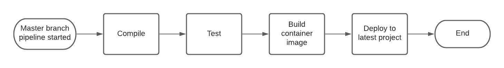
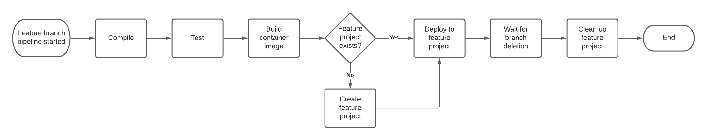
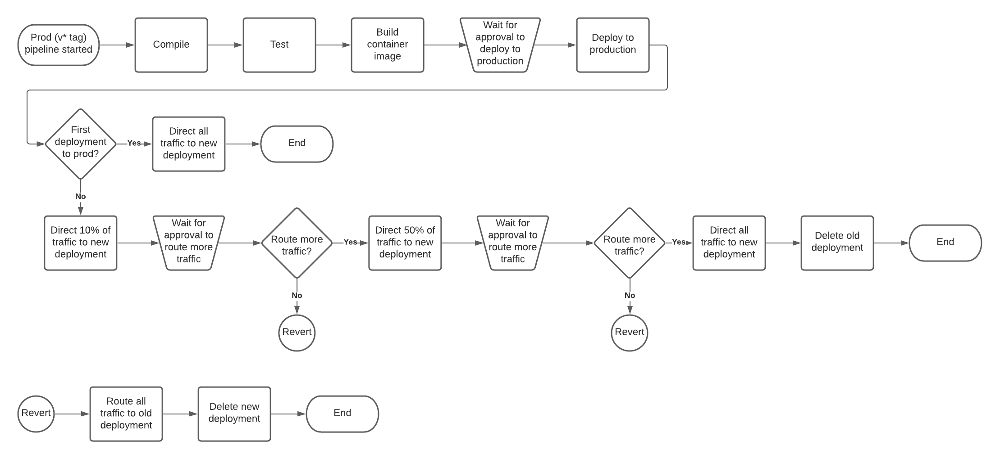

# End to End GitLab CI/CD Pipeline

## Why was this pipeline created?

This pipeline was created to integrate GitLab CI/CD and OpenShift. The three main goals of this pipeline were:
* Automate the deployment of code from GitLab as containerized applications within OpenShift
* Create ephemeral environments within OpenShift for each feature branch
* Use a blue/green deployment architecture in production.

## What's in this folder?

In this folder is an example of how you can use GitLab CI/CD with OpenShift to manage your application deployments. There is `.gitlab-ci.yml`, which defines the pipeline, Helm charts used as templates for the building and deploying of applications, a Dockerfile used to build the container image for the application, flow diagrams of the pipeline logic, and this README.

## What does the pipeline do?

First, for all pipeline runs, it will compile the code, and then build a container image for the application. Then, depending on the branch or tag the pipeline is running on, it will deploy to different locations.

* If running on the master branch, it will deploy to the `latest` environment for the application.



* If running on a non-master, feature branch, it will create an ephemeral feature project for the feature branch if it does not already exist, and then deploy to the ephemeral feature project. This gives developers an environment to test just the feature they are working on without contention for a limited number of dev environments. The pipeline will wait until the feature branch is deleted, and then delete the ephemeral feature project to reclaim resources on the cluster.



* If running on a tag matching the `v*` pattern (for example v1.0.1), it will deploy to the `production` environment. There are 4 stages for the production deployment, each requiring a manual action to start: `deploy_to_prod`, `prod_set_to_50`, `prod_set_to_100`, and `prod_revert`. The logic of when to run the jobs depends on the situation.
    * If this is the first production deployment for this application, all traffic will be routed to this deployment during the `deploy_to_prod` job. This is the only job that needs to be run for this deployment.
    * If this is the second or later production deployment for this application, 10% of traffic will be routed to the new deployment during the `deploy_to_prod` job. 50% of traffic will be routed to the new deployment during the `prod_set_to_50` job, and 100% of traffic will be routed to the new deployment during the `prod_set_to_100` job. In addition, during the `prod_set_to_100` job, the old deployment will be deleted.
    * If, during a second or later production deployment for this application, at a point before the `prod_set_to_100` job has been completed, a problem has been noticed, and it is decided to revert to the old version, the `prod_revert` job can be run. This will delete the new deployment and route all traffic to the old deployment.
    * `prod_revert` will not work for the first deployment, or after `prod_set_to_100` is completed. If a bug is noticed during one of these scenarios, a new production deployment will be needed to resolve the issue.



## Creating the GitLab runner

A GitLab runner is what runs the pipeline jobs. While there are shared runners available, the runner can be set up to run within the OpenShift cluster. GitLab has provided an operator to manage the GitLab runner. Set it up following the steps here: https://www.openshift.com/blog/installing-the-gitlab-runner-the-openshift-way. Add a tag to the runner that the pipeline can use to specify where to run jobs on. This example uses `ocp-runner`.

## Service Account

An OpenShift ServiceAccount should be used with the pipeline.  We use a service account named `gitlab-ci-default` in the `gitlab-serviceaccounts` project.  This service account should have `self-provisioner` privileges so it is able to create the ephemeral feature projects.

  ```bash
  oc new-project gitlab-serviceaccounts
  oc create serviceaccount gitlab-ci-default
  oc adm policy add-cluster-role-to-user self-provisioner system:serviceaccount:gitlab-serviceaccounts:gitlab-ci-default
  oc serviceaccounts get-token gitlab-ci-default # The output of this command will be used later as `OCP_SA_TOKEN`
  ```

## Onboarding Applications

* Add the files in this folder, excluding this README and the diagrams folder, to your project.
* Update the following variables in `.gitlab-ci.yml`:
    * `PROJECT_SHORTNAME`: This should be a short, yet identifying name for your application. It will be used througout the pipeline and templates for the naming of resources.
    * `FEATURE_BRANCH_ADMINS`: A list of users, typically developers, who should have the `admin` OpenShift role on the feature branch projects
* If needed, environment variables can be set per environment by adding `--set secret.VARIABLE_NAME=VALUE` lines to the helm command in the appropriate job. The values can either be set directly in the pipline, or in the [GitLab CI/CD settings](https://docs.gitlab.com/ee/ci/variables/#via-the-ui)

Example:
  ```bash
  deploy_latest:
  ...
  script:
    # deploy using helm chart and oc
    - helm template $PROJECT_SHORTNAME-latest helm/deploy-template/
      --set replicaCount="3"
      --set image="$PROJECT_SHORTNAME-build/$PROJECT_SHORTNAME:$CI_COMMIT_REF_SLUG"
      --set host="$PROJECT_SHORTNAME-latest"
      --set cluster="$OCP_CLUSTER"
      --set deploymentStrategy="non-prod"
      --set secret.VARIABLE_ONE="one"
      --set secret.VARIABLE_TWO="$TWO"
      |
      oc apply -f - -n $PROJECT_SHORTNAME-latest $DEV_AUTH_INFO
  ...
  ```
* If needed, update the Dockerfile to work with your application.
* If needed, update the commands in the build, test, and compile jobs to meet the needs of your appliation.
* If needed, use a different builder image. The [`ocp-tools`](https://gitlab.com/mrjbanksy/ocp-tools) image in use by default is based on the UBI8-minimal image, with `oc`, `helm`, `java 11`, and `maven` installed.
* Create the following projects in the OpenShift cluster using the shortname set up in `.gitlab-ci.yml` from the first step, and grant `image-puller` rights in the build project to the deployment projects:
    * `$PROJECT_SHORTNAME-build`
    * `$PROJECT_SHORTNAME-latest`
    * `$PROJECT_SHORTNAME-prod`

Example:
  ```bash
  export PROJECT_SHORTNAME=myapp
  oc new-project $PROJECT_SHORTNAME-build
  oc new-project $PROJECT_SHORTNAME-latest
  oc new-project $PROJECT_SHORTNAME-prod
  oc policy add-role-to-group system:image-puller system:serviceaccounts:$PROJECT_SHORTNAME-latest -n $PROJECT_SHORTNAME-build
  oc policy add-role-to-group system:image-puller system:serviceaccounts:$PROJECT_SHORTNAME-prod -n $PROJECT_SHORTNAME-build
  ```

* Add the development [service account](#service-account) and any additional users who need view/edit/admin permissions to the development projects following the [steps to add roles using RBAC](https://docs.openshift.com/container-platform/4.5/authentication/using-rbac.html#adding-roles_using-rbac)

Example:
  ```bash
  export PROJECT_SHORTNAME=myapp
  oc policy add-role-to-user admin system:serviceaccount:gitlab-serviceaccounts:gitlab-ci-default -n $PROJECT_SHORTNAME-build # admin is needed in order to be able to grant image-puller privileges
  oc policy add-role-to-user edit system:serviceaccount:gitlab-serviceaccounts:gitlab-ci-default -n $PROJECT_SHORTNAME-latest
  oc policy add-role-to-user edit system:serviceaccount:gitlab-serviceaccounts:gitlab-ci-default -n $PROJECT_SHORTNAME-prod
  ```
* Set the following variables in the [GitLab CI/CD settings](https://docs.gitlab.com/ee/ci/variables/#via-the-ui):
    * `OCP_CLUSTER`: The URL of the cluster, for example `cluster.company.com`
    * `OCP_SA_TOKEN`: The token of the service account that will be used. This was retrieved with the `oc serviceaccounts get-token gitlab-ci-default` command earlier.

## Customizing the pipeline

The pipeline can be extended or customized to meet the needs of the application. Here are some possible example changes:

* Update the strategy of when to deploy to production. The current logic uses tags matching the `v*` pattern (for example v1.0.1) to signify a production release.
* Additional jobs can be added. For example, to deploy to a different qa testing environment, create a qa testing project, and create another deploy job modeled from the existing `deploy_*` jobs.
* If using a different cluster for production deployments, modify the `PROD_AUTH_INFO` variable at the beginning of the pipeline file to use the production cluster.

